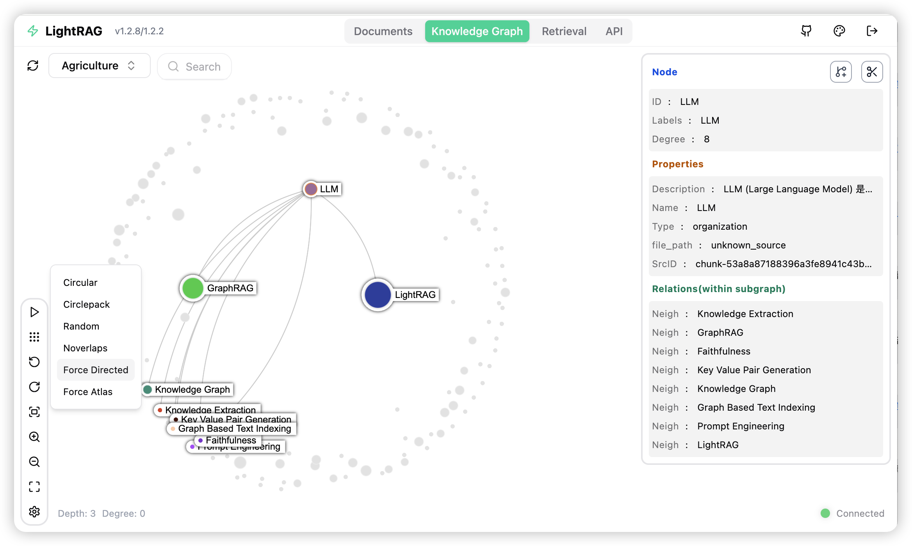

<div align="center">

# 🚀 ForgeMind: 简单且快速的检索增强生成（RAG）框架

<p>
  <a href='https://github.com/krishrathi1/ForgeMind-AI'></a>
  <a href="https://github.com/krishrathi1/ForgeMind-AI/stargazers"></a>
</p>
<p>
  
</p>
<p>
  <a href="README-zh.md"></a>
  <a href="README.md"></a>
  <a href="README-ja.md"></a>
</p>

Maintained by **Krish** ([@krishrathi1](https://github.com/krishrathi1)).

</div>

<details>
  <summary style="font-size: 1.4em; font-weight: bold; cursor: pointer; display: list-item;">
    算法流程图
  </summary>


*图1：索引流程图*

*图2：检索和查询流程图*

</details>

## 安装

**💡 使用 uv 进行包管理**: 本项目使用 [uv](https://docs.astral.sh/uv/) 进行快速可靠的 Python 包管理。首先安装 uv: `curl -LsSf https://astral.sh/uv/install.sh | sh` (Unix/macOS) 或 `powershell -c "irm https://astral.sh/uv/install.ps1 | iex"` (Windows)

> **注意**：如果您愿意，也可以使用 pip，但为了获得更好的性能 and 更可靠的依赖管理，建议使用 uv。
>
> **📦 离线部署**: 对于离线或隔离环境，请参阅[离线部署指南](./docs/OfflineDeployment.md)，了解预安装所有依赖项和缓存文件的说明。

### 安装ForgeMind服务器

* 从PyPI安装

```bash
### 使用 uv 安装 ForgeMind 服务器（作为工具，推荐)
uv tool install "forgemind-ai[api]"

### 或使用 pip
# python -m venv .venv
# source .venv/bin/activate  # Windows: .venv\Scripts\activate
# pip install "forgemind-ai[api]"

### 构建前端代码
cd forgemind_webui
bun install --frozen-lockfile
bun run build
cd ..

# 配置 env 文件
# 从 GitHub 仓库的根目录上下载 env.example 文件
# 或从本地检出的源代码中获取 env.example 文件
cp env.example .env  # 使用你的LLM和Embedding模型访问参数更新.env文件
# 启动 API-WebUI 服务。默认绑定所有网络接口(0.0.0.0)。
# 安全提示:对外网暴露前,请在 .env 中配置认证(FORGEMIND_API_KEY,或
# AUTH_ACCOUNTS 搭配 TOKEN_SECRET);若仅需本机访问,可绑定 127.0.0.1;
# 否则所有接口都将公开可访问。
# 注意:为兼容 Ollama 客户端,/api/* 路由默认不鉴权;如需对其启用认证,
# 请将 WHITELIST_PATHS 收窄为 /health。
forgemind-server
```

* 从源代码安装

```bash
git clone https://github.com/krishrathi1/ForgeMind-AI.git
cd ForgeMind

# 一键初始化开发环境（推荐）
make dev
source .venv/bin/activate  # 激活虚拟环境 (Linux/macOS)
# Windows 系统: .venv\Scripts\activate

# make dev 会安装测试工具链以及完整的离线依赖栈
# （API、存储后端与各类 Provider 集成），并构建前端；不会生成 .env。
# 启动服务前请先运行 make env-base，或手动从 env.example 复制并配置 .env。

# 使用 uv 的等价手动步骤
# 注意: uv sync 会自动在 .venv/ 目录创建虚拟环境
uv sync --extra test --extra offline
source .venv/bin/activate  # 激活虚拟环境 (Linux/macOS)
# Windows 系统: .venv\Scripts\activate

### 或使用 pip 和虚拟环境
# python -m venv .venv
# source .venv/bin/activate  # Windows: .venv\Scripts\activate
# pip install -e ".[test,offline]"

# 构建前端代码
cd forgemind_webui
bun install --frozen-lockfile
bun run build
cd ..

# 配置 env 文件
make env-base  # 或: cp env.example .env 后手动修改
# 启动API-WebUI服务
forgemind-server
```

* 使用 Docker Compose 启动 ForgeMind 服务器

```bash
git clone https://github.com/krishrathi1/ForgeMind-AI.git
cd ForgeMind
cp env.example .env  # 使用你的LLM和Embedding模型访问参数更新.env文件
# modify LLM and Embedding settings in .env
docker compose up
```

> 在此获取ForgeMind docker镜像历史版本: [ForgeMind Docker Images]( https://github.com/krishrathi1/ForgeMind-AI/pkgs/container/forgemind)
>
> 由 GitHub Actions 发布到 GHCR 的官方镜像已使用 GitHub OIDC 和 Sigstore Cosign 进行签名。校验方式请参阅 [docs/DockerDeployment.md](./docs/DockerDeployment.md#verify-official-ghcr-images-with-cosign)。
>
> 在 Apple Silicon（macOS 26）上，无需 Docker Desktop 即可在 Apple 原生的 `container` 运行时上运行相同的 Postgres/Neo4j/Milvus 存储栈 —— 参见 [docs/AppleContainerSetup.md](./docs/AppleContainerSetup.md)。

### 使用设置向导创建 .env 文件

除了手动编辑 `env.example` 之外，您还可以使用交互式向导生成配置好的 `.env`，并在需要时生成 `docker-compose.final.yml`：

```bash
make env-base           # 必跑第一步：配置 LLM、Embedding、Reranker
make env-storage        # 可选：配置存储后端和数据库服务
make env-server         # 可选：配置服务端口、鉴权和 SSL
make env-base-rewrite   # 可选：强制重建向导托管的 compose 服务块
make env-storage-rewrite # 可选：强制重建向导托管的 compose 服务块
make env-security-check # 可选：审计当前 .env 中的安全风险
```

设置向导工具的详细说明请参阅 [docs/InteractiveSetup.md](./docs/InteractiveSetup.md)。

### 可选：docx smart_heading 的 spaCy 模型

Native docx 解析器的可选引擎参数 `smart_heading` 使用 spaCy 做分句/NER 启发式判断。spaCy 运行时已包含在 `api` extra 中——只有两个钉定版本的语言模型（`zh_core_web_sm` / `en_core_web_sm` 3.8.0，GitHub release wheel，未发布到 PyPI）需要额外一步安装：

```bash
forgemind-download-cache --spacy --spacy-install
```

可以按文件/规则启用 smart_heading（如 `FORGEMIND_PARSER=docx:native(smart_heading=true)`），也可以在 `.env` 中全局启用：

```bash
# 路由到 native 引擎的 .docx 文件默认启用 smart_heading；
# 单个文件/规则可用显式 native(smart_heading=false) 关闭。
DOCX_SMART_HEADING=true
```

全局开关开启（或 `FORGEMIND_PARSER` 规则携带 `native(smart_heading=true)`）时，服务器会在启动阶段校验模型并在缺失时立即报错（附安装指引）。从不启用 smart_heading 的部署无需安装模型。Docker 主镜像已内置模型（lite 镜像不含）；离线环境请参阅[离线部署指南](./docs/OfflineDeployment.md)。

## 关于ForgeMind

### 基于图的轻量级RAG框架

**ForgeMind** 是一个轻量级的知识图谱 RAG 框架，被视为 Microsoft GraphRAG 的高效替代方案。它采用双层架构来同时管理知识图谱（KG）和向量嵌入，完美填补了传统基于向量的 RAG 与基于图谱的 RAG 之间的技术鸿沟。ForgeMind专为高扩展性而设计，有效地解决了大规模图谱索引和查询时计算开销大、响应缓慢以及增量更新成本高等问题；ForgeMind在支持大规模数据集的同时，即使搭载 30B开源大语言模型（LLM），也能保持极高的RAG质量。

### 特点与优势

1. **深度上下文理解**：通过图结构索引，ForgeMind 能够捕捉实体间复杂的语义依赖关系，克服了传统分块检索方法上下文割裂的缺陷。在需要全局理解或逻辑推理的垂直领域（如法律、金融），其生成质量与上下文感知能力尤为突出。
2. **卓越的全面性与多样性**：ForgeMind的双层检索机制使其能够同时整合详细事实与抽象概念，让其在查询结果全面性（Comprehensiveness）和多样性（Diversity）取得卓越的成绩，有效应对复杂的跨文档查询。
3. **极高的检索效率与低成本**：ForgeMind不需要依赖低效的社区报告和复杂查询时的多跳推理，大幅度减少了索引和查询阶段对LLM的调用，显著减少了响应延迟与LLM计算成本。
4. **快速适应动态数据**：ForgeMind 支持无缝的增量知识库更新。新数据只需经过标准的图索引流程生成局部图谱，即可通过集合合并的方式直接融入现有图谱，无需破坏原有结构或重建全局索引，保证了系统在动态数据环境下的时效性。删除文档时可以利用构建阶段的LLM缓存快速重建受影响的实体关系，大幅度提高了知识库更新效率。

### 多模态能力的升级

从 ForgeMind v1.5 版本开始，该框架正式引入了对多模态文档的分析和检索能力：

* **多引擎文档解析：** 其文件处理流水线（Pipeline）支持使用 MinerU、Docling 和 Native 文档解析引擎，可高效提取文档中的文字、表格、公式和图片。
* **跨模态实体与关系映射：** 在统一的框架内实现跨模态的实体提取和关系映射，从而达成无缝的索引与查询。
* **应用场景提升：** 全新的多模态处理流水线能够大幅提高操作说明书、学术论文等含有丰富多模态内容文档的 RAG 质量。

### ForgeMind API 服务器

ForgeMind 服务器不仅提供给了一个供出选择体验ForgeMind功能的Web UI，还提供了一个完整的 `REST API`。有关ForgeMind服务器的更多信息，请参阅[ForgeMind服务器](./docs/ForgeMind-API-Server-zh.md)。



## 关键配置说明

### LLM 模型的选择

ForgeMind 的工作过程中需要使用到 4 种角色的 LLM/VLM。应该为不同角色的 LLM 配置不同能力和速度的模型，以获得速度和能力之间的平衡。ForgeMind 对大型语言模型（LLM）的能力要求会高于传统 RAG，因为它需要 LLM 执行文档中的实体关系抽取任务。在查询阶段，LLM 模型需要处理 ForgeMind 召回的实体、关系和文本块等大量信息，需要模型具备在含有噪声的长上下文中作出高质量回答的能力。

**按角色推荐的模型：**

- **抽取 LLM（`EXTRACT`）**：实体关系抽取会对每个文本块调用，选择主流的高速模型即可，并**强烈推荐使用非思考模型（关闭 reasoning/thinking 模式）**，以免抽取变慢、变贵。国外可选 GPT-5.6-luna、Claude Haiku、Gemini-mini；国内可选 DeepSeek-V4-lite、Kimi。本地部署最低可考虑 Qwen3-30B-A3B-Instruct。
- **查询 LLM（`QUERY`）**：负责在长且嘈杂的召回内容上生成最终答案，应选择比抽取模型*更强*的模型，尽量提高回答质量；此处使用带思考能力的模型没有问题。
- **关键词 LLM（`KEYWORD`）**：轻量、对延迟敏感的环节，**一定要选择非思考模型**以降低查询延迟；选用与抽取模型相当的高速模型即可。
- **VLM（`VLM`）**：主流的多模态模型均可，需支持图片输入。本地部署可考虑 Qwen3.6-35B-A3B。

在可接受的时间和价格范围内，优先选择评分（各类公开榜单/基准）越高的模型越好。详细的模型配置请参见 [RoleSpecificLLMConfiguration-zh.md](./docs/RoleSpecificLLMConfiguration-zh.md)

### 查询模式的选择

ForgeMind 支持 4 种查询模式：

- **local**：聚焦于局部上下文与具体实体的精准匹配。在知识图谱中检索对应的候选实体及其直接关联属性，适用于针对特定对象、具体概念或细节事实的问答，能够提供高度相关且细致的局部上下文支持。
- **global**：侧重于宏观主题、跨文档推理与实体间的深层关系。检索覆盖广泛主题与概念的关系链，适用于需要跨多个上下文进行总结、趋势分析或理解复杂语义依赖关系的查询。
- **hybrid**：融合 local 和 global 两种模式的检索结果。通过同时召回具体实体与全局关系上下文，进行综合推理与生成。
- **naive**：基于文本块的传统 RAG 检索，不使用知识图谱，直接依赖向量相似性在原始文本块中进行检索。
- **mix**：全功能模式，融合 local、global 和 naive 三种模式的检索结果，提供最为丰富和全面的检索结果。

ForgeMind 的默认查询模式为 mix。使用 mix 模式通常可以获得最为理想的查询结果。mix 模式比 naive 耗时略长；其他查询模式在耗时上基本相当。

### Embedding 模型

在选择 Embedding 模型的时候需要注意其对多语言的支持能力。ForgeMind 的检索质量对 Embedding 模型的依赖有限，因此建议尽量选择低维度和速度快的模型。选择主流最新的 Embedding 模型即可；本地部署首选 `BAAI/bge-m3`。建议尽量本地部署 Embedding 模型，以获得最好的性能。

**重要提示**：在文档索引前必须确定使用的 Embedding 模型，且在文档查询阶段必须沿用与索引阶段相同的模型。嵌入模型一旦选定通常就不能修改。如果修改的话，需要对所有文本块、实体和关系进行重新嵌入。ForgeMind 目前没有提供重新嵌入的工具。有些存储（例如 PostgreSQL）在首次建立数据表的时候需要确定向量维度，因此更换 Embedding 模型后需要删除向量相关库表，以便让 ForgeMind 重建新的库表。

### 开启 Rerank 选项

查询阶段开启 Rerank 选项可以显著提高查询的质量。开启 Rerank 通常会引入 1～2 秒的延时。为了降低延时，建议尽量在本地部署 Rerank 模型。主流最新的 Reranker 皆可，本地部署推荐 `BAAI/bge-reranker-v2-m3`。Rerank 的相关配置方式请参考 `.env.example` 文件。Rerank 模型与 Embedding 模型不同，可以在查询阶段随时更换。

### 文档处理流水线的配置

ForgeMind 的默认流水线配置并不能让系统发挥最好的性能。文件内容解析的好坏会极大地影响文档的索引和查询效果。因此建议配置流水线开启 MinerU 文件解析引擎，并开启流水线的图片分析功能。建议添加的配置为：

```
FORGEMIND_PARSER=*:native-iteP,*:mineru-iteP,*:legacy-R

VLM_PROCESS_ENABLE=true
VLM_LLM_MODEL=<your_vlm_model_name>
```

由于云端的 MinerU 服务有使用量、文件大小和页数等限制，建议使用本地部署的 MinerU。文件处理流水线的具体配置方法请参考 [FileProcessingPipeline-zh.md](./docs/FileProcessingPipeline-zh.md)

### 文件处理并发优化

对于大规模的文档处理，需要提高文档处理的并发能力。几个涉及文件并发处理性能的关键环境变量包括：

- **MAX_ASYNC_LLM/EXTRACT_ASYNC_LLM**：控制 LLM 模型的最大并发数。
- **MAX_PARALLEL_INSERT**：控制并行处理文件的最大数量。单个文件内的文本、表格、公式、图片之间的处理也会并发进行。`MAX_PARALLEL_INSERT` 应该为 `MAX_ASYNC_LLM` 的 1/3 左右为宜。
- **MAX_PARALLEL_PARSE_MINERU**：控制 MinerU 文件解析的并发处理文件数。
- **MAX_PARALLEL_PARSE_DOCLING**：控制 Docling 文件解析的并发处理文件数。
- **EMBEDDING_FUNC_MAX_ASYNC**：控制嵌入模型的最大并发数。
- **EMBEDDING_BATCH_NUM**：控制每个嵌入模型请求包含的待嵌入文本的数量（每批做多少个嵌入）；提高这个数量可以大幅度减少调用嵌入模型的次数，提高嵌入存储的落盘速度。

```
# 设置示例
MAX_ASYNC_LLM=8
MAX_PARALLEL_INSERT=3
EMBEDDING_FUNC_MAX_ASYNC=16
EMBEDDING_BATCH_NUM=32
```

### 后台存储的选择

ForgeMind 需要使用到 4 种后台存储类型，分别是：

- **KV_STORAGE**：用于保存 LLM 响应缓存、文本分块结果、实体关系提取结果等信息。
- **VECTOR_STORAGE**：用于保存文本块、实体和关系的向量信息。
- **GRAPH_STORAGE**：用于保存知识图谱。
- **DOC_STATUS_STORAGE**：用于保存文件列表。

ForgeMind 的默认存储全部都是基于文件进行持久化的内存数据库。默认存储仅用于开发调试，不适合用于生产环境部署。生产环境如果希望使用同一个后台数据解决 4 种类型的后台存储，可以选择 PostgreSQL、MongoDB 或 OpenSearch。也可以单独为向量存储或图存储选择专业化的数据库，例如使用 Milvus 或 Qdrant 作为向量存储，使用 Neo4j 或 Memgraph 作为图存储。

### 文档处理阶段其他重要配置

在文档插入阶段还有以下环境变量建议根据实际需要进行调整：

- **SUMMARY_LANGUAGE**：控制 LLM 输出实体关系名称和摘要时使用的语言，例如：`Chinese`, `English`。
- **ENTITY_EXTRACTION_USE_JSON**：控制 LLM 输出实体关系的时候是否使用 JSON 格式。使用 JSON 格式通常可以获得更加稳定的效果，但是输出需要消耗更多的 Token，速度也会略微慢一些。
- **ENABLE_CONTENT_HEADINGS**：控制查询阶段是否把文本块所属章节标题信息送给LLM（默认允许，为LLM提供更多的上下文信息）
- **FORCE_LLM_SUMMARY_ON_MERGE / MAX_SOURCE_IDS_PER_RELATION**：控制每个`实体/关系`能够最多与多少个文本块保持关联
- **SOURCE_IDS_LIMIT_METHOD**：控制`实体/关系`关联文本块超过限制后是否继续更新实体关系的描述（默认不再更新，因为此时实体关系的描述已经足够丰富，继续更新的意义不大；放弃更新可以极大地提高知识库的构建速度）
- **DEFAULT_MAX_FILE_PATHS**：控制`实体/关系`关联的原始文件的最大数量，超过这个数量之后新的文件名不再写入到向量存储。

### 解决实体关系抽取阶段的 LLM 超时

实体关系抽取阶段的 LLM 超时通常源于以下三种原因之一。先判断原因，再采用对应的解决方案（参数可以组合使用）：

- **模型太慢。** 速度低于约 50 tokens/秒的模型，可能无法在请求超时前完成包含大量实体关系的文本块的抽取。可以通过 `*_LLM_TIMEOUT` 增大超时时间——既可以是全局的 `LLM_TIMEOUT`，也可以是抽取阶段专用的角色参数 `EXTRACT_LLM_TIMEOUT`。注意实际的执行超时是所配置值的**两倍**，因此 `EXTRACT_LLM_TIMEOUT=300` 对应最长 **600 秒**。
- **文本块产生的实体关系太多。** 例如参考文献文本块会让模型输出极其大量的记录，从而无法在限定时间内完成。可以通过 `OPENAI_LLM_MAX_TOKENS` 或 `OPENAI_LLM_MAX_COMPLETION_TOKENS` 限制输出长度（具体参数名取决于 LLM 供应商，详见 `env.example`）。一个实用的估算规则是 `max_output_tokens < LLM_TIMEOUT × 每秒token数`（例如 `9000 < 240s × 50 tps`）。
- **模型存在缺陷，陷入输出死循环。** 某些模型（尤其是本地部署的 Qwen 模型）在遇到特殊文本时偶尔会陷入无尽的输出死循环。如果是偶发情况，通常只需将该文档重新处理一次即可解决。
- **专门针对参考文献（P 分块策略）。** 使用段落语义（`P`）分块策略（例如 `FORGEMIND_PARSER=...-iteP`）时，设置 `CHUNK_P_DROP_REFERENCES=true` 可在分块前自动删除末尾的参考文献部分，从而避免参考文献产生大量低价值的实体关系（这是导致超时的常见原因）。也可以通过文件名提示 `paper.[-P(drop_rf=true)].pdf` 对单个文件启用；相关的检测参数（`CHUNK_P_REFERENCES_TAIL_N`、`CHUNK_P_REFERENCES_HEADINGS`）详见 `env.example`。

### 文档查询阶段其他重要配置

在文档查询阶段还有以下环境变量建议根据实际需要进行调整：
- **MAX_ENTITY_TOKENS / MAX_RELATION_TOKENS / MAX_TOTAL_TOKENS**：控制召回内容送给LLM上下文的Token长度。召回内容包含`实体`、`关系`和`文本块`三部分，实体和关系的长度可以单独控制长度，文本块的长度由总长度减去实体和关系的长度来控制。
- **ENABLE_CONTENT_HEADINGS**：控制是否把文本块所在的章节标题送给LLM；默认开启，可以为LLM提供更加丰富的上下文信息，提高回答质量。
- **ENABLE_LLM_CACHE**：是否允许缓存查询结果。默认开启，相同的查询问题、查询模式、LLM模型参数将返回相同的结果。

## 使用ForgeMind SDK

> ⚠️ **如果您希望将ForgeMind集成到您的项目中，建议您使用ForgeMind Server提供的REST API**。ForgeMind SDK通常用于嵌入式应用，或供希望进行研究与评估的学者使用。

### 安装ForgeMind SDK

* 从源代码安装

```bash
cd ForgeMind
# 注意: uv sync 会自动在 .venv/ 目录创建虚拟环境
uv sync
source .venv/bin/activate  # 激活虚拟环境 (Linux/macOS)
# Windows 系统: .venv\Scripts\activate

# 或: pip install -e .
```

* 从PyPI安装

```bash
uv pip install forgemind-ai
# 或: pip install forgemind-ai
```

### ForgeMind SDK示例代码

ForgeMind核心功能的示例代码请参见`examples`目录。您还可参照[视频](https://www.youtube.com/watch?v=g21royNJ4fw)视频完成环境配置。若已持有OpenAI API密钥，可以通过以下命令运行演示代码：

```bash
### you should run the demo code with project folder
cd ForgeMind
### provide your API-KEY for OpenAI
export OPENAI_API_KEY="sk-...your_opeai_key..."
### download the demo document of "A Christmas Carol" by Charles Dickens
curl https://raw.githubusercontent.com/gusye1234/nano-graphrag/main/tests/mock_data.txt > ./book.txt
### run the demo code
python examples/forgemind_openai_demo.py
```

如需流式响应示例的实现代码，请参阅 `examples/forgemind_openai_compatible_demo.py`。运行前，请确保根据需求修改示例代码中的LLM及嵌入模型配置。

**注意1**：在运行demo程序的时候需要注意，不同的测试程序可能使用的是不同的embedding模型，更换不同的embeding模型的时候需要把清空数据目录（`./dickens`），否则层序执行会出错。如果你想保留LLM缓存，可以在清除数据目录时保留`kv_store_llm_response_cache.json`文件。

**注意2**：官方支持的示例代码仅为 `forgemind_openai_demo.py` 和 `forgemind_openai_compatible_demo.py` 两个文件。其他示例文件均为社区贡献内容，尚未经过完整测试与优化。

### 使用SDK的注意事项

SDK的使用说明详见 **[docs/ProgramingWithCore.md](./docs/ProgramingWithCore.md)**（英文）。有部份ForgeMind功能没有提供 REST API，仅能够通过SDK使用。这部份功能往往是不稳定，不能保证在将来的版本上可以兼容。

## 重现论文结果

ForgeMind 在农业、计算机科学、法律和混合等领域均显著优于 NaiveRAG、RQ-RAG、HyDE 和 GraphRAG。完整评估方法论、提示词和复现步骤详见 **[docs/Reproduce.md](./docs/Reproduce.md)**（英文）。

### 总体性能表

||**农业**||**计算机科学**||**法律**||**混合**||
|----------------------|---------------|------------|------|------------|---------|------------|-------|------------|
||NaiveRAG|**ForgeMind**|NaiveRAG|**ForgeMind**|NaiveRAG|**ForgeMind**|NaiveRAG|**ForgeMind**|
|**全面性**|32.4%|**67.6%**|38.4%|**61.6%**|16.4%|**83.6%**|38.8%|**61.2%**|
|**多样性**|23.6%|**76.4%**|38.0%|**62.0%**|13.6%|**86.4%**|32.4%|**67.6%**|
|**赋能性**|32.4%|**67.6%**|38.8%|**61.2%**|16.4%|**83.6%**|42.8%|**57.2%**|
|**总体**|32.4%|**67.6%**|38.8%|**61.2%**|15.2%|**84.8%**|40.0%|**60.0%**|
||RQ-RAG|**ForgeMind**|RQ-RAG|**ForgeMind**|RQ-RAG|**ForgeMind**|RQ-RAG|**ForgeMind**|
|**全面性**|31.6%|**68.4%**|38.8%|**61.2%**|15.2%|**84.8%**|39.2%|**60.8%**|
|**多样性**|29.2%|**70.8%**|39.2%|**60.8%**|11.6%|**88.4%**|30.8%|**69.2%**|
|**赋能性**|31.6%|**68.4%**|36.4%|**63.6%**|15.2%|**84.8%**|42.4%|**57.6%**|
|**总体**|32.4%|**67.6%**|38.0%|**62.0%**|14.4%|**85.6%**|40.0%|**60.0%**|
||HyDE|**ForgeMind**|HyDE|**ForgeMind**|HyDE|**ForgeMind**|HyDE|**ForgeMind**|
|**全面性**|26.0%|**74.0%**|41.6%|**58.4%**|26.8%|**73.2%**|40.4%|**59.6%**|
|**多样性**|24.0%|**76.0%**|38.8%|**61.2%**|20.0%|**80.0%**|32.4%|**67.6%**|
|**赋能性**|25.2%|**74.8%**|40.8%|**59.2%**|26.0%|**74.0%**|46.0%|**54.0%**|
|**总体**|24.8%|**75.2%**|41.6%|**58.4%**|26.4%|**73.6%**|42.4%|**57.6%**|
||GraphRAG|**ForgeMind**|GraphRAG|**ForgeMind**|GraphRAG|**ForgeMind**|GraphRAG|**ForgeMind**|
|**全面性**|45.6%|**54.4%**|48.4%|**51.6%**|48.4%|**51.6%**|**50.4%**|49.6%|
|**多样性**|22.8%|**77.2%**|40.8%|**59.2%**|26.4%|**73.6%**|36.0%|**64.0%**|
|**赋能性**|41.2%|**58.8%**|45.2%|**54.8%**|43.6%|**56.4%**|**50.8%**|49.2%|
|**总体**|45.2%|**54.8%**|48.0%|**52.0%**|47.2%|**52.8%**|**50.4%**|49.6%|


## ⭐ Star 历史

[](https://star-history.com/#krishrathi1/ForgeMind-AI&Date)

## 🤝 贡献

<div align="center">
  我们欢迎各种形式的贡献——Bug 修复、新功能、文档改进等。<br>
  提交 Pull Request 前，请阅读 <a href=".github/CONTRIBUTING.md"><strong>贡献指南</strong></a>。
</div>

<br>

<div align="center">
  我们感谢所有贡献者做出的宝贵贡献。
</div>

<div align="center">
  <a href="https://github.com/krishrathi1/ForgeMind-AI/graphs/contributors">
    
  </a>
</div>


<div align="center" style="background: linear-gradient(135deg, #667eea 0%, #764ba2 100%); border-radius: 15px; padding: 30px; margin: 30px 0;">
  <div>
    
  </div>
  <div style="margin-top: 20px;">
    <a href="https://github.com/krishrathi1/ForgeMind-AI" style="text-decoration: none;">
      
    </a>
    <a href="https://github.com/krishrathi1/ForgeMind-AI/issues" style="text-decoration: none;">
      
    </a>
    <a href="https://github.com/krishrathi1/ForgeMind-AI/discussions" style="text-decoration: none;">
      
    </a>
  </div>
</div>

<div align="center">
  <div style="width: 100%; max-width: 600px; margin: 20px auto; padding: 20px; background: linear-gradient(135deg, rgba(0, 217, 255, 0.1) 0%, rgba(0, 217, 255, 0.05) 100%); border-radius: 15px; border: 1px solid rgba(0, 217, 255, 0.2);">
    <div style="display: flex; justify-content: center; align-items: center; gap: 15px;">
      <span style="font-size: 24px;">⭐</span>
      <span style="color: #00d9ff; font-size: 18px;">感谢您访问 ForgeMind!</span>
      <span style="font-size: 24px;">⭐</span>
    </div>
  </div>
</div>
